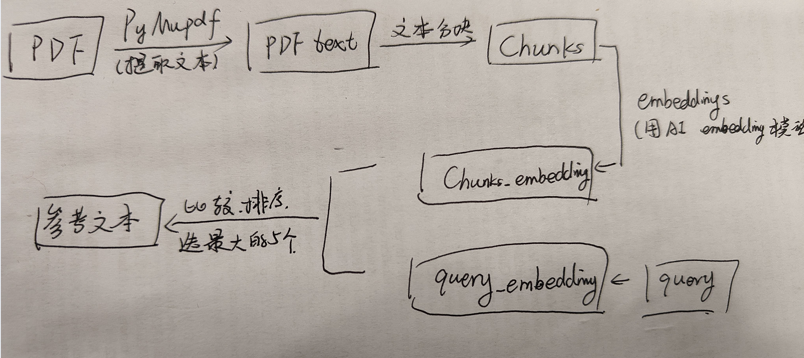

# RAGpractice
This repository was created to rewrite RAG 

## SimpleRAG实现流程(2025.7.6-7.7 work)
- 1. 利用PyMupdf(fitz)库进行提取文本，并对文本进行分块
- 2. 对分块的文本进行embedding（使用"text-embedding-v4"）
- 3. 通过使用cosine-similar方法进行query和分块文本的embedding对比后排序，得到最符合的参考文本。
- 4. 根据参考文本进行回答。

## 关键问题：
- 1. PDF处理办法：PyMupdf库
- 2. embedding方法：使用阿里云大模型text-embedding-v4
- 3. rerank使用：暂无使用rerank
- 4. 检索用的方法：cosine-similarity的方法进行检索。

## 关于RAG相关总结(2025.7.7)

### 关于embedding方法总结

1. word embedding
2. sentense embedding

### 关于相似度计算方法总结

1. cosine-similarity：即用余弦值方法来计算高维空间中向量的相对距离。
2. Manhatten/Euclidean distance：即欧拉距离差的平方和求和距离差的绝对值求和。

## PyMuPDF、MistralOCR、OCRFlux 在OmniDocBench上的测试(2025.7.8)

比较了不同OCR模型的parser效果。
- **parser/code:** 测试代码

**问题：**OCRFlux-3B模型文档上12GB的显存即可，但是实际上RTX3090 24GB的显存刚刚好。使用官方的ocrflux.pipeline的高度封装工具无法对GPU的资源参数进行设置，导致显存溢出而崩溃。因而重新写一个简单脚本进行运行即可泡桐

## 比较结果：
| 模型 (Methods) | OverallEdit↓ (EN/ZH) | TextEdit↓ (EN/ZH) | FormulaEdit↓ (EN/ZH) | FormulaCDM↑ (EN/ZH) | TableTEDS↑ (EN/ZH) | TableEdit↓ (EN/ZH) | Read OrderEdit↓ (EN/ZH) |
| :--- | :---: | :---: | :---: | :---: | :---: | :---: | :---: |
| **end2end** | **0.194 / NaN** | **0.073 / 0.556** | 0.493 / NaN | - / - | 86.131 / 74.884	 | **0.128 / 0.179** | **0.082 / 0.326** |
| PyMuPDF | 1.000 / 1.000 | 1.000 / 1.000 | 1.000 / 1.000 | - / - | 0.000 / 0.000 | 1.000 / 1.000 | 1.000 / 1.000 |
| MistralOCR-latest | 0.255 / 0.407 | 0.057 / 0.271 | 0.316 / 0.481 | - / - | 78.840 / 67.269 | 0.585 / 0.640 | 0.062/0.238 |
| OCRFlux-3B | 0.251 / 0.349 | 0.136 / 0.261 | 0.457 / 0.721 | - / - | 71.324 / 81.657 | 0.252 / 0.142 | 0.161 / 0.273 |
| Gemini2.5-Pro | 0.148 / 0.212 | 0.055 / 0.168 | 0.356 / 0.439 | 80.0 / 69.4 | 85.8 / 86.4 | 0.13 / 0.119 | 0.049/0.121 |

## 2025.7.9